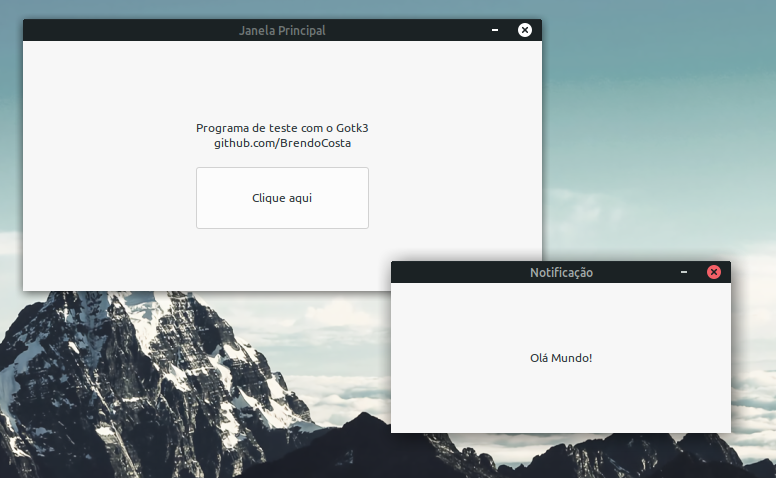

# Gotk3-OlaMundo
"Olá Mundo!" em Go com os bindings do [gotk3](https://github.com/gotk3/gotk3) para o toolkit de interfaces gráficas GTK 3
  

## Descrição
Este é um pequeno aplicativo escrito em Go com os bindings do gotk3 para GTK 3. Quando executado, ele exibirá uma label e um botão numa janela inicial. Quando o botão dessa janela for clicado, o evento "BotaoClicado" definido no template (olaMundo.glade) será acionado e tratado no código principal (olaMundo.go), onde uma segunda janela com uma label "Olá Mundo!" será exibida. Mais exemplos podem ser vistos no [repositório oficial](https://github.com/gotk3/gotk3-examples).

## Build

### Requisitos

* Go >= 1.13
* gotk3 (requer ainda `libgtk-3-dev` `libcairo2-dev` e `libglib2.0-dev`, [nomes variam dependendo da distro](https://github.com/gotk3/gotk3/wiki/Installing-on-Linux))
* Glade (caso queira visualizar ou editar o template de forma mais interativa)

### Nota
Se a sua versão do GLib for igual ao inferior a 2.66, o build no Go deverá ser feito com `-tags=glib_2_66` (mais informações [aqui](https://github.com/gotk3/gotk3/pull/828)).
